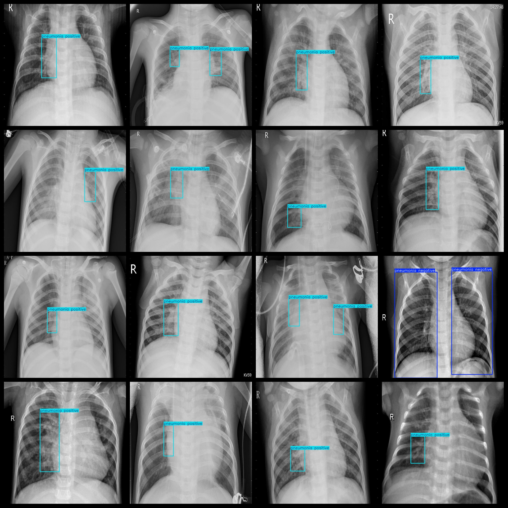

# Pneumonia; Detection Dataset 3023 imagesVOC+YOLO

Pneumonia detection dataset 3023 VOCs + YOLOs

Dataset format: Pascal VOC format + YOLO format (the txt file does not contain the split path, it only contains jpg images and corresponding VOC format xml files and yolo format txt files)

Number of images (total number of jpg files): 3023

Number of xml files: 3023

Number of txt files: 3023

Label count: 2

The Github repository is: datasets_sl

["pneumonia negative", "pneumonia positive"]

Number of boxes labeled in each category:

Pneumonia negative frame count = 460 (Pneumonia negative frame count)

pneumonia positive frame count = 3896 (pneumonia positive)

Total Frames: 4356

Number of images per category:

Pneumonia negative, with 230 pictures owned.

Pneumonia Positive Count = 2793

Image resolution: 640x640

Use the labeling tool: labelImg

Dataset Augmentation: No

Rules for annotation: Draw a rectangle around the category.

Important note: The dataset does not have been divided into training, validation, and testing sets.

Special Disclaimer: This dataset does not guarantee the accuracy of the trained models or weight files.

Annotation and image details are as follows:

## Images

---

Here is a pay link on Stripe (https://buy.stripe.com/3cs8yP7sY87d0vu9AB). Please contact me lonlonago@foxmail.com after funding $89, and I will send you a complete data files, thank you!

